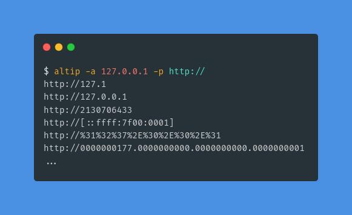
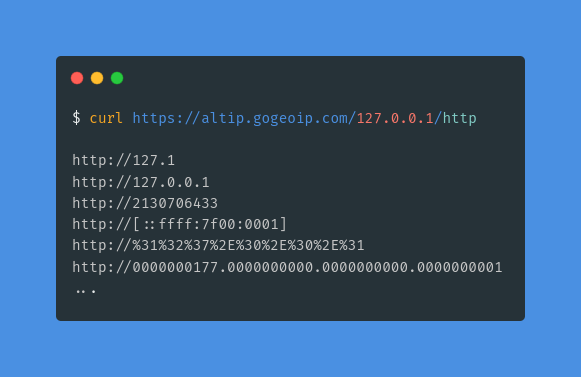

# AltIP - Convert an IP into Alternative / Obfuscated versions
[![Demo][ico-website-status]][link-demo]
[![License][ico-license]][link-license]

Converts any given input (`IPv4`, `IPv6` or `Domain name`) into a set of alternative and
obfuscated representations of itself.

An online demo is available at: https://altip.gogeoip.com

## Usage
### CLI
```
Usage of altip:
  -a, --address string    IP or Domain to obfuscate
  -p, --prefix string     Prefix to be added in front of the obfuscated ip
  -H, --host string       API host address to bind to (default "127.0.0.1")
  -P, --port integer      API port to listen on (default 8066)
  -s, --serve       	  Serve a public api endpoint
  -h, --help              Prints help information 
```



#### Example without prefix
```bash
altip -a 127.0.0.1
```
```text
127.0.0.1
2130706433
0x7F.0x00.0x00.0x01
...
```

#### Example with prefix
```bash
altip -a 127.0.0.1 -p http://
```
```text
http://127.0.0.1
http://2130706433
http://0x7F.0x00.0x00.0x01
...
```

#### Serve the API
```bash
altip --serve
```
```text
Listening on: http://127.0.0.1:8066/
```


### API
API url: `/{ip or hostname}/{optional prefix}`



> The given hostname will be resolved (if possible) to its corresponding ip address, the results may vary.

#### Example without prefix
```bash
curl https://altip.gogeoip.com/127.0.0.1
```
```text
127.0.0.1
2130706433
0x7F.0x00.0x00.0x01
0177.0000.0000.0001
0x000000007F.0x0000000000.0x0000000000.0x0000000001
0000000177.0000000000.0000000000.0000000001
0x7F.0x00.0x00.1
0x7F.0x00.0.1
0x7F.0.0.1
0x7F.0x0.0x0.1
0x7F.0x0.0.1
0177.0000.0000.1
0177.0000.0.1
0177.0.0.1
0x7F.0x00.1
0x7F.0x0.1
0177.0000.1
0x7F.1
0177.1
0x7F.0x00.0000.0001
0x7F.0x0.0000.0001
0x7F.0000.0000.0001
0x7F000001
017700000001
0x7F.0000.1
127.0.1
127.1
0177.0.0.01
0x7f.0x0.0x0.0x1
0x7f000001
0xb3326efc937f000001
111111111111111101111111000000000000000000000001
0x7f.0.0.0x1
::ffff:7f00:0001
0x249e9c416d7f000001
281472812449793
%3A%3A%66%66%66%66%3A%37%66%30%30%3A%30%30%30%31
%31%32%37%2E%30%2E%30%2E%31
127.000.000.001
```

#### Example with prefix
```bash
curl https://altip.gogeoip.com/127.0.0.1/http
```
```text
http://127.0.0.1
http://2130706433
http://0x7F.0x00.0x00.0x01
http://0177.0000.0000.0001
http://0x000000007F.0x0000000000.0x0000000000.0x0000000001
http://0000000177.0000000000.0000000000.0000000001
http://0x7F.0x00.0x00.1
http://0x7F.0x00.0.1
http://0x7F.0.0.1
http://0x7F.0x0.0x0.1
http://0x7F.0x0.0.1
http://0177.0000.0000.1
http://0177.0000.0.1
http://0177.0.0.1
http://0x7F.0x00.1
http://0x7F.0x0.1
http://0177.0000.1
http://0x7F.1
http://0177.1
http://0x7F.0x00.0000.0001
http://0x7F.0x0.0000.0001
http://0x7F.0000.0000.0001
http://0x7F000001
http://017700000001
http://0x7F.0000.1
http://127.0.1
http://127.1
http://0177.0.0.01
http://0x7f.0x0.0x0.0x1
http://0x7f000001
http://0x49d6efb9217f000001
http://111111111111111101111111000000000000000000000001
http://0x7f.0.0.0x1
http://[::ffff:7f00:0001]
http://0x98c2c880b27f000001
http://281472812449793
http://%3A%3A%66%66%66%66%3A%37%66%30%30%3A%30%30%30%31
http://%31%32%37%2E%30%2E%30%2E%31
http://127.000.000.001
```

## Build
```bash
git clone https://github.com/Webklex/altip
cd altip
go build -o altip main.go
```

## Credits
Inspired by [OsandaMalith/IPObfuscator](https://github.com/OsandaMalith/IPObfuscator).
- [projectdiscovery/mapcidr](https://github.com/projectdiscovery/mapcidr)

## License
The MIT License (MIT). Please see [License File][link-license] for more information.

[ico-license]: https://img.shields.io/badge/license-MIT-brightgreen.svg?style=flat-square
[ico-website-status]: https://img.shields.io/website?down_message=Offline&label=Demo&style=flat-square&up_message=Online&url=https%3A%2F%2Faltip.gogeoip.com%2F

[link-demo]: https://altip.gogeoip.com/
[link-license]: https://github.com/Webklex/altip/blob/master/LICENSE